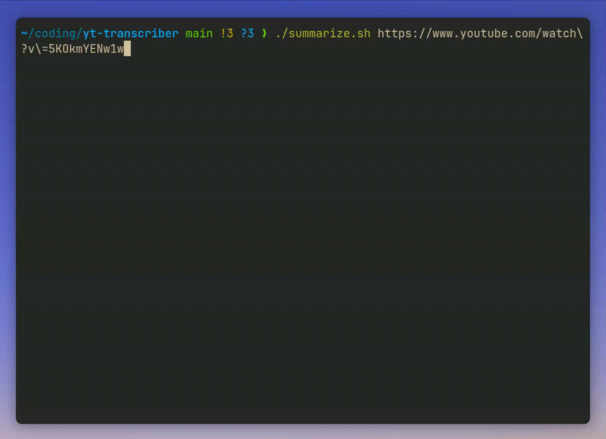

# yt-transcriber
Gets the transcript of a youtube video, and saves it to a text file. The transcript is then put through a summarization model (distilBART) to generate a summary of the video. The summary is saved to a text file as well.

## Demo


## Installation

```bash
pip install -r requirements.txt
sudo chmod +x summarize.sh
./summarize.sh <youtube_url>
```
On the first run the script will download the model weights for the summarization model. This will take a few minutes.

